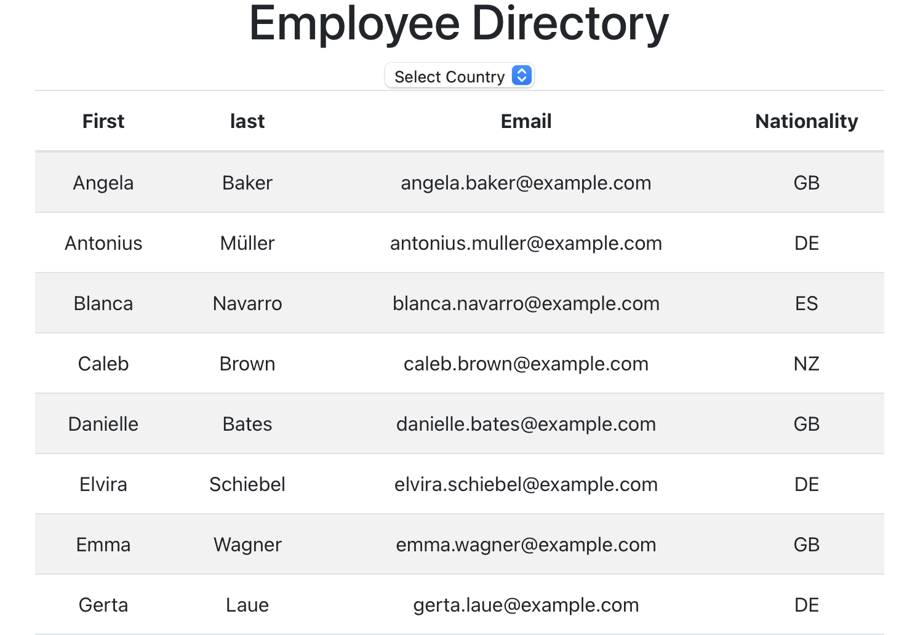

# Employee Directory

## Table of Contents
[Description](#description)  
[Installation](#Installation)  
[Test](#Testing)  
[Project Links](#live-Site-and-Repo)  
[License](#License)  
[Contributors](#Contributors)  

## Description
* This is a react app that displays a list of people from a random user generator. You can then filiter the results by nationality.

## Installation
* App deployed on heroku

## Testing
* No testing available

## Live Site and Repo
* [live Site](https://ajl-employee-directory.herokuapp.com)
* [Repo](https://github.com/ajlaursen/employee-directory)

## License
* 

## Contributors
* Contributor: [Alex Laursen](https://github.com/Ajlaursen) Email: [contact@ajlaursen.codes](mailto:contact@ajlaursen.codes)

